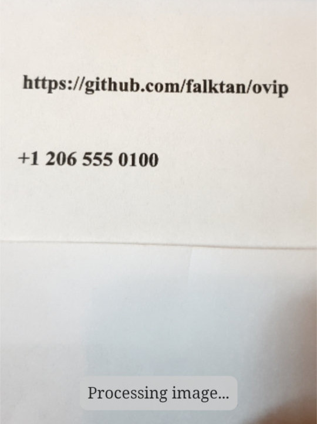
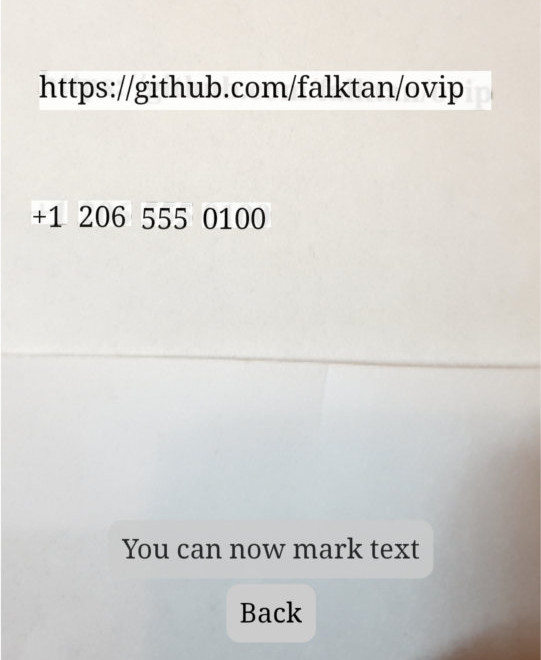
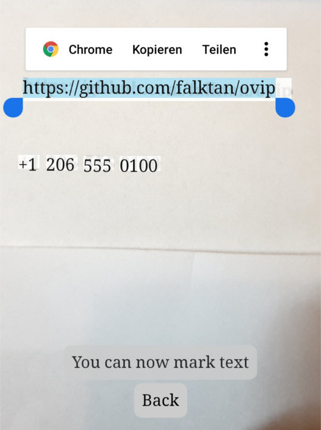
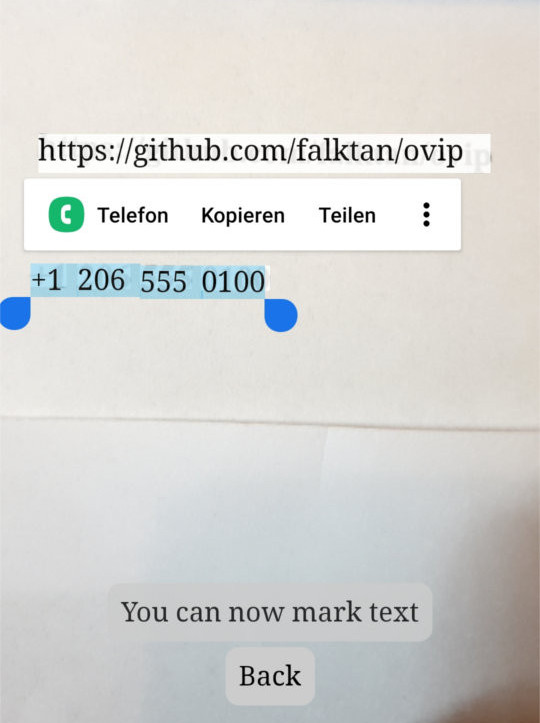

# OViP - Open Vision App

The app is hosted on Github pages here: https://falktan.github.io/ovip/

This is a mobile app (as PWA) that provides features related to OCR and image recognition. A central design guideline is to provide this as an application without backend, to avoid the need to send (possibly private) fotos to a backend server and with the added benefit, that it also works offline.

## Sample usage

When opening the app, it allows to take a photo.

It then applies optical character recognition (OCR) to make the text available for usage.

Any text can be marked and be copied. If it is a URL also an option to directly open it in the browser is provided.

Similarily, if it is a phone number it can directly be called.

## Icon
The icon was purchased here ("royalty-free licence"; The author is Guilherme Schmitt on thenounproject.com):
https://thenounproject.com/term/anime/2972504/

## Motivation
This project was stated as a "capstone project" for a machine learning course on Udacity. A detailed motivation for this work has been provided in a [proposal document](proposal.md).